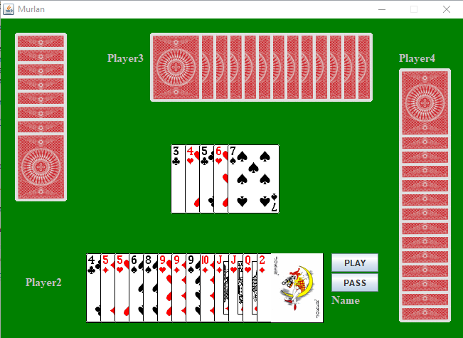
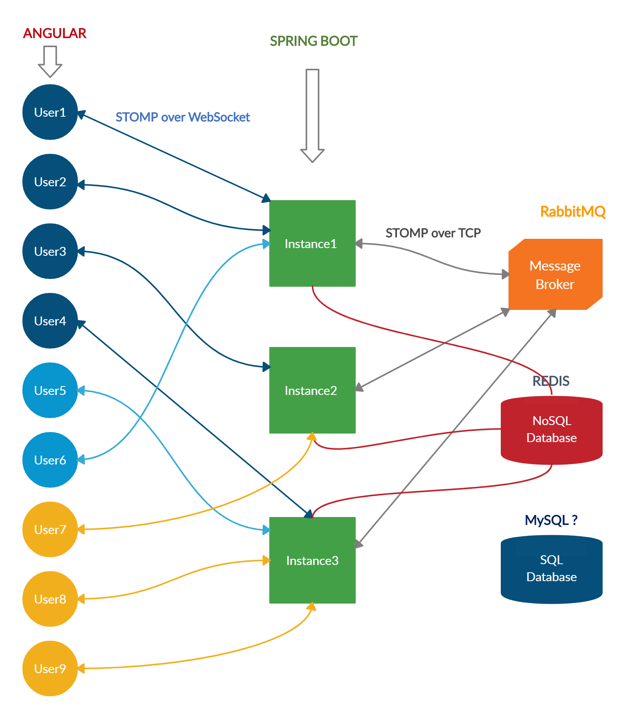

# murlan-card-game
Murlan Card Game

In this repo you may find the work that I (Luis Pashaj) did during my Software Engineering - Bachelor studies in the Canadian Institute of Technology here in Tirana, Albania.

Basically there are two Murlan card game versions:

1) Offline Singleplayer (fully playable according the Murlan game rules, against 3 computer opponents)
   - Java, SwingUI
   - 

2) Online Multiplayer (proof of concept + technical design document)
   - Java, Spring Boot, Websocket, STOMP, Typescript, Angular, Redis, RabbitMQ, MySQL
   - 
